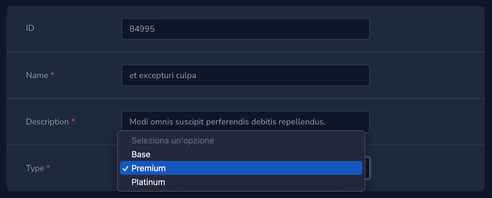
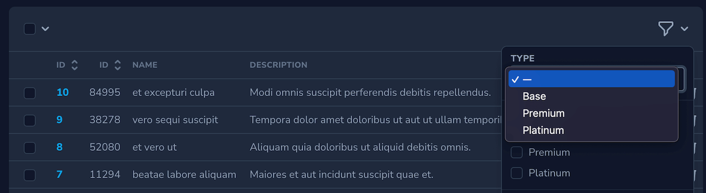
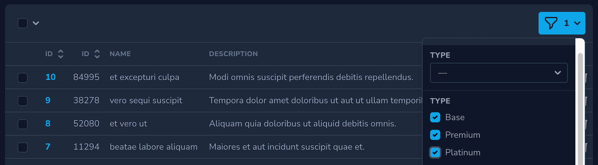

[](https://packagist.org/packages/datomatic/nova-enum-field)
[](https://github.com/datomatic/nova-enum-field/actions/workflows/php-cs-fixer.yml)
[](https://packagist.org/packages/datomatic/nova-enum-field)
# Laravel Nova Enum Field

Nova field for enum in PHP 8.1 and above (both pure `Enum` and `BackedEnum`) with [datomatic/enum-helper](https://github.com/datomatic/enum-helper) and [datomatic/laravel-enum-helper](https://github.com/datomatic/laravel-enum-helper) compatibility.  



There is also a Nova Select filter and Nova Boolean filter:



## Installation

You can install this package in a Laravel app that uses [Nova](https://nova.laravel.com) via composer:

```bash
composer require datomatic/nova-enum-field
```

## Setup

```php
use App\Enums\UserType;
use Illuminate\Database\Eloquent\Model;

class Example extends Model
{
    protected $casts = [
        'user_type' => UserType::class,
    ];
}
```

## Usage

You can use the `Enum` field in your Nova resource like this:

```php
namespace App\Nova;

use App\Enums\UserType;
use Datomatic\Nova\Fields\Enum\Enum;

class Example extends Resource
{
    // ...

    public function fields(Request $request)
    {
        return [
            // ...

            Enum::make('User Type','user_type')->attach(UserType::class),

            // ...
        ];
    }
}
```

If you use [datomatic/laravel-enum-helper](https://github.com/datomatic/laravel-enum-helper) you can set optionally a custom dynamic property or/and a subset of cases.  
The default property is `description`.
```php
Enum::make('User Type','user_type')
    ->property('excerpt')
    ->cases([UserType::ADMINISTRATOR,UserType::MODERATOR])
    ->attach(UserType::class),
```

### Filters

If you would like to use the provided Nova Select filter, you can include it like this:

```php
namespace App\Nova;

use App\Enums\UserPermissions;
use App\Enums\UserType;
use Datomatic\Nova\Fields\Enum\EnumFilter;

class Example extends Resource
{
    // ...

    public function filters(Request $request)
    {
        return [
            EnumFilter::make('user_type', UserType::class),
                
             // With optional name and default value:
            EnumFilter::make('user_type', UserType::class)
                ->name(__('User Type'))
                ->default(UserType::ADMINISTRATOR)
        ];
    }
}
```

Alternatively, you may wish to use the provided Nova Boolean filter:

```php
namespace App\Nova;

use App\Enums\UserPermissions;
use App\Enums\UserType;
use Datomatic\Nova\Fields\Enum\EnumBooleanFilter;

class Example extends Resource
{
    // ...

    public function filters(Request $request)
    {
        return [
            EnumBooleanFilter::make('user_type', UserType::class),
                
            // With optional name and default value:
            EnumBooleanFilter::make('user_type', UserType::class)
                ->name(__('User Type'))
                ->default([UserType::ADMINISTRATOR, UserType::MODERATOR])
        ];
    }
}
```

If you use [datomatic/laravel-enum-helper](https://github.com/datomatic/laravel-enum-helper) you can set optionally a custom dynamic property or/and a subset of cases.  
The default property is `description`.
```php
// Enum filter
EnumFilter::make('user_type', UserType::class)
    ->name('User Type')
    ->property('excerpt')
    ->cases([UserType::ADMINISTRATOR,UserType::MODERATOR])
// Boolean Enum filter
EnumBooleanFilter::make('user_type', UserType::class)
    ->name('User Type')
    ->property('excerpt')
    ->cases([UserType::ADMINISTRATOR,UserType::MODERATOR])
```

## Credits
- [Alberto Peripolli](https://github.com/trippo)
- [All Contributors](../../contributors)

## Thanks
- [Süleyman ÖZEV](https://github.com/suleymanozev)
- [simplesquid/nova-enum-field](https://github.com/simplesquid/nova-enum-field)

## License

The MIT License (MIT). Please see [License File](LICENSE.txt) for more information.
